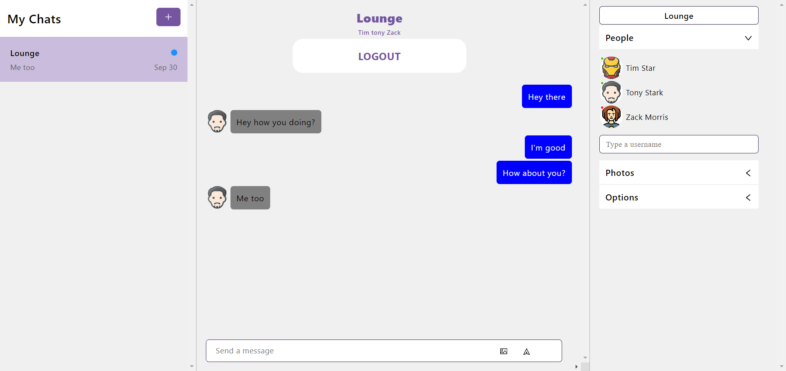
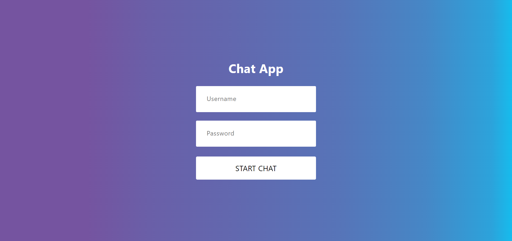

# Chat-App with chatengine.io

## Description

This project is a realtime Chat app using chatengine.io. The users and the rooms are created in the chatengine.io, also a user as an admin can create a chat room and add users.\
The purpose was exploring chatengine.io

---

## Table Of Contents
                             
- [Description](#description)
- [Usage](#usage)
- [License](#license)
- [Credits](#credits)
- [Questions](#questions)

---

## Usage

User has to login to use the chat app, if not the page is redirected to the login.

--- 
## License

This Project is licenced under MIT license.

---
## Credits

Base code, and tutorial from [JavascriptMastery](https://www.youtube.com/@javascriptmastery)

---

## Questions

You can find more about my work at my Github [oliver23n](https://github.com/oliver23n).

